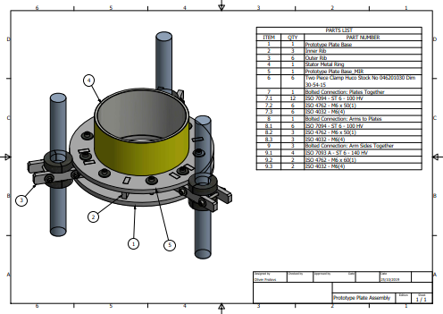

# prototype-plate

A set of parts to make a prototype plate for the rotor rig.

* It was used to hold the stator mock-up and some sensors.
* Manufacturing method: Laser-cut
* Material: MDF

&mdash; Oliver Frolovs, University of Bristol, 2019